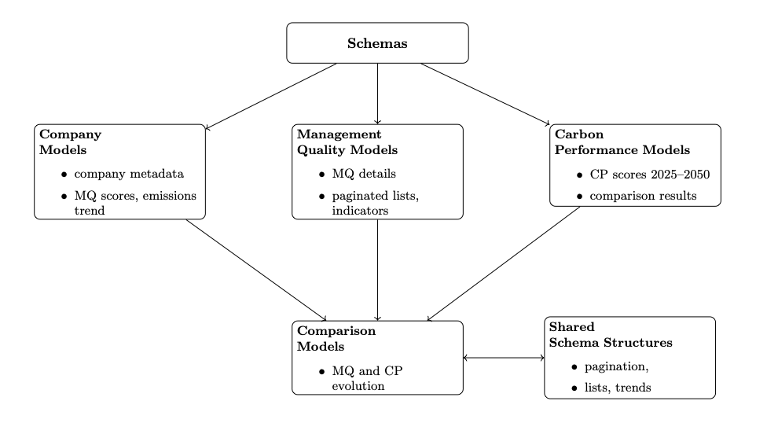

# Problem Set 1 - Data Infrastructure Engineering 

## TPI Assessment API - A FastAPI-based application to retrieve, process, and compare Transition Pathway Initiative (TPI) Data
> This repository contains a FastAPI application that automatically detects and processes the latest Transition Pathway Initiative (TPI) CSV data. By extracting both Management Quality (MQ) and Carbon Performance (CP) assessments, it provides a suite of endpoints for retrieving up-to-date company scores, comparing performance across assessment cycles, and analyzing trends at sector or company level. The application is structured to meet academic standards for data validation, error handling, and robust documentation, ensuring it can be easily reviewed and extended.

## Table of Contents
1. [Features](#features)
2. [Directory Structure](#directory-structure)
3. [Prerequisites and Installation](#prerequisites-and-installation)
4. [Running the Application](#running-the-application)
5. [Usage and API Endpoints](#usage-and-api-endpoints)
6. [CP and MQ API Overview](#cp-and-mq-api-overview)
7. [Data Source and Format](#data-source-and-format)
8. [Unit Testing](#unit-testing)
9. [Future Improvements](#future-improvements)
10. [Conclusion](#conclusion)

## Features

This section outlines the key functionalities and capabilities of the API. It highlights how the system is designed to efficiently process and serve company assessments, ensuring ease of use, scalability, and accuracy. Below are the main features included in this project:

- **Dynamic Data Loading**: Automatically selects the latest available dataset at runtime — no manual updates required.
- **RESTful FastAPI Architecture**: Modular routes for Company, Management Quality (MQ), and Carbon Performance (CP) assessments.
- **Schema-Driven Validation**: Uses Pydantic models to enforce strict data types, handle missing values, and ensure consistent API responses.
- **Optimized Data Handling**: Fast pandas-based querying with support for filtering, sorting, and pagination on large datasets.
- **Performance Comparison Tools**: Built-in endpoints for cross-year comparisons of MQ and CP data at the company level.
- **Sector-Based Insights**: Enables users to explore assessment trends and performance within specific sectors.

## Directory Structure

This project is organized for clarity, modularity, and ease of expansion. Core components like routing, validation, and testing are separated by concern.
```bash
├── data/                             # CSV datasets used for assessments
├── routes/                           # FastAPI route handlers
│   ├── company_routes.py             # Company assessments endpoints
│   ├── mq_routes.py                  # Management Quality endpoints
│   └── cp_routes.py                  # Carbon Performance endpoints
├── tests/                            # Unit tests for route handlers and utilities
│   ├── test_main.py                  # Tests related to the main application entry point
│   ├── test_company_routes.py        # Unit tests for Company endpoints
│   ├── test_mq_routes.py             # Unit tests for MQ endpoints
│   ├── test_cp_routes.py             # Unit tests for CP endpoints
│   └── test_helpers.py               # Tests for helper functions
├── utils.py                        # Utility functions for dynamic file handling and normalization
├── schemas.py                        # Pydantic models for data validation
├── main.py                           # Application entry point
├── requirements.txt                  # Project dependencies
└── README.md                         # Documentation
```

To replicate this structure locally, run the following:
```bash
# Create project root and enter it
mkdir tpi_api && cd tpi_api

# Create folders and main scripts
mkdir data routes tests
touch main.py schemas.py utils.py requirements.txt README.md

# Add route and test files
touch routes/{__init__,company_routes,mq_routes,cp_routes}.py
touch tests/{__init__,test_main,test_company_routes,test_mq_routes,test_cp_routes,test_helpers}.py

# Set up and activate virtual environment
python -m venv venv
source venv/bin/activate   # or venv\Scripts\activate on Windows
```
**Note**: 

- Add `__init__.py` to `routes/` and `tests/` to enable clean imports and `pytest` test discovery.
- Use a virtual environment to isolate dependencies and avoid package conflicts across projects.

## Prerequisites and Installation
Before installing and running the application, ensure your system meets the following requirements:
- **Python 3.8 or higher** (Check version with `python --version` or `python3 --version`)
- **pip (Python package manager)** (Ensure it is installed with `pip --version`)
- **Virtual Environment (venv)** (Recommended for dependency isolation)
- **FastAPI & Uvicorn** (For running the API server)

To install the dependencies for this project, run the code below in the terminal.  
```bash
pip install -r requirements.txt
```

> *A note on setting up the requirements file*: I found the easiest way to set up this file and ensure all the dependencies are accurately captured was to populate the requirements.txt file once the entire project was fully set up and running. To replicate the same, make sure you run the command below when the project is running and you are still in the virtual environment `pip freeze > requirements.txt`

## Running the Application
After installing dependencies and activating your virtual environment (as described in the previous section), you can run the FastAPI application locally. Navigate to your project's root directory—where your `main.py` file is located—and execute the following command in your terminal:
```bash
uvicorn main:app --reload
```
`--reload` here enables automatic reload, ensuring that the server reflects any changes in real-time, significantly speeding up the development cycle. 

Upon successful execution, the terminal will indicate that the server is like and the API can be accessed via the following endpoints: 
- **Base URL**: http://127.0.0.1:8000/
- **Interactive API documentation (Swagger UI)**: http://127.0.0.1:8000/docs

You can stop the Uvicorn server at anytime by pressing `CTRL + C` in the terminal.

## Usage and API Endpoints 
This project follows a modular architecture using **FastAPI**, a modern web framework designed for high performance and robust data validation. The core application (`main.py`) initializes the FastAPI instance and integrates specialized route modules for company data, Management Quality (MQ), and Carbon Performance (CP) assessments.

### Route Modules Overview
There are three main functional modules integrated into the application: 
1. **Company Routes (`company_routes.py`)**
   - Manages endpoints related to companies and their assessments.
   - Dynamically loads the latest dataset for up-to-date company-level information.
   - Supports listing, historical retrieval, and performance comparisons.
2. **Management Quality (MQ) Routes (`mq_routes.py`)**
   - Handles endpoints for MQ assessments and trends.
   - Supports methodology-cycle filtering and sector-wide trend analysis.
   - Uses dynamic loading of MQ-specific datasets.
3. **Carbon Performance (CP) Routes (`cp_routes.py`)**
   - Focuses on CP alignment data and historical performance.
   - Consolidates multiple CP files into a unified dataset.
   - Provides endpoints for alignment checks and inter-cycle comparisons.

Each route module is registered in `main.py` using FastAPI routers under the `/v1` namespace. Incoming requests are dispatched to the appropriate route based on the URL path.

### Schema Relationships
Central to ensuring the correctness and consistency of data across the entire API is the `schemas.py` module. This module contains Pydantic models used to validate and serialize data sent to and from the API. These models define clear and strict data structures for companies, MQ assessments, CP assessments, and various response formats, including pagination and performance comparisons. Leveraging Pydantic’s automatic data validation ensures robustness and significantly reduces errors due to data inconsistencies.

The following diagram illustrates how the data models in `schemas.py` are structured and relate to each other.



- All models inherit from a common `BaseModel` foundation using **Pydantic**, enabling consistent data validation across endpoints.
- The **Company Models** capture shared metadata such as company ID, sector, and assessment year, and are extended in both MQ and CP contexts.
- **Management Quality Models** include detailed records, indicator mappings, and paginated responses tied to MQ-specific endpoints.
- **Carbon Performance Models** model long-term target alignment (e.g., 2025–2050) and comparison logic for CP assessments.
- **Comparison Models** bridge both MQ and CP data over time, enabling performance evolution tracking.
- **Shared Schema Structures** like pagination and trend responses support uniform API response formatting across modules.

This architecture ensures:
- Clear **separation of concerns** across modules.
- Strict **validation guarantees** for all returned data.
- Easy **scalability** for adding new endpoints or features.

## CP and MQ API Overview 
This section summarizes the key endpoints related to **Management Quality (MQ)** and **Carbon Performance (CP)**, including their functionality, HTTP method, and usage.

| **Area** | **Endpoint** | **Method** | **Purpose** | **Sample URL** |
|----------|--------------|------------|-------------|----------------|
| CP    | `/v1/cp/latest` | GET | Fetch the latest CP assessments | `http://127.0.0.1:8000/v1/cp/latest` |
| CP    | `/v1/cp/company/{company_id}` | GET | Retrieve a company’s CP history | `http://127.0.0.1:8000/v1/cp/company/vectren` |
| CP    | `/v1/cp/company/{company_id}/alignment` | GET | Check CP alignment with future targets | `http://127.0.0.1:8000/v1/cp/company/vectren/alignment` |
| CP    | `/v1/cp/company/{company_id}/comparison` | GET | Compare CP performance across cycles | `http://127.0.0.1:8000/v1/cp/company/vectren/comparison` |
| MQ    | `/v1/mq/latest` | GET | Fetch the latest MQ assessments | `http://127.0.0.1:8000/v1/mq/latest` |
| MQ    | `/v1/mq/methodology/{methodology_id}` | GET | View MQ assessments by methodology cycle | `http://127.0.0.1:8000/v1/mq/methodology/1` |
| MQ    | `/v1/mq/trends/sector/{sector_id}` | GET | View MQ trends within a sector | `http://127.0.0.1:8000/v1/mq/trends/sector/coal%20mining` |

> *Each endpoint is backed by Pydantic models in `schemas.py`, ensuring strict validation and consistent responses. See [Swagger UI](http://127.0.0.1:8000/docs) for live examples and schema definitions.*

## Data Source and Format
This project uses datasets sourced from the [Transition Pathway Initiative (TPI)](https://www.transitionpathwayinitiative.org/corporates)
, specifically focuses on:
- **Company Assessments**
- **Management Quality (MQ) Scores**
- **Carbon Performance (CP) Targets**

### Data Organization

- **Folder Naming**: Datasets are organized in directories named:  
  `TPI sector data - All sectors - MMDDYYYY`
- **File Format**: All data files are CSVs with consistent structure.

### Dataset Types

- **Company Assessments**:  
  `Company_Latest_Assessments_MMDDYYYY.csv`  
  Includes company name, sector, geography, latest assessment year, MQ score, and CP alignment.

- **MQ Assessments**:  
  `MQ_Assessments_Methodology_*.csv`  
  Contains detailed MQ scores by methodology cycle, including sector-level insights.

- **CP Assessments**:  
  `CP_Assessments_*.csv`  
  Records CP alignment across future targets (2025, 2027, 2035, 2050).

### Data Handling

- **Dynamic Selection**: The API automatically loads the most recent available dataset.
- **No Manual Updates Needed**: Dataset detection and parsing are fully automated.
- **Benefits**:  
  - **Scalable** — Easily integrates future datasets.  
  - **Robust** — Handles consistent date formatting and structure.  
  - **Flexible** — Supports continuous updates without code changes.
  
> This application exclusively uses publicly available datasets from the [Transition Pathway Initiative (TPI)](https://www.transitionpathwayinitiative.org/), which are released for research and transparency purposes. No personal, sensitive, or proprietary data is included. The API is intended for use by researchers, sustainability analysts, and policy professionals seeking to evaluate corporate climate performance. There are no foreseeable ethical concerns associated with the data processing, storage, or publication conducted by this project.

## Unit Testing
To ensure code reliability and correctness, this project adopts a modular testing approach using `pytest` and FastAPI's built-in `TestClient`. Each core component — from API routes to utility functions — is tested independently to validate behavior, edge cases, and failure responses.

The following table outlines the scope of each test file:
| Test File | Scope |
|-----------|-------|
| `test_main.py` | Verifies root endpoint and Swagger UI loads |
| `test_company_routes.py` | Tests company listing, details, history, and performance comparison |
| `test_mq_routes.py` | Tests latest MQ, trends, methodology filtering |
| `test_cp_routes.py` | Tests CP history, alignment, and comparison endpoints |
| `test_helpers.py` | Tests dynamic file retrieval and normalization logic |

These tests are structured to: 
- Ensure endpoints return expected data under both normal and edge-case inputs.
- Catch regressions as data changes over time.
- Provide confidence during refactoring and feature addition.

To run the tests, follow the given command in the terminal: `pytest`. 

## Future Improvements

While the API is functional and modular, there are clear opportunities to extend its capabilities, improve performance, and enhance usability:
- **Interactive Visualization and Dashboards**
   - Develop interactive dashboards using visualization libraries (such as Plotly, Dash, or Streamlit) to enable intuitive exploration and deeper insights into Management Quality (MQ) and Carbon Performance (CP) assessments across companies, sectors, and geographic regions.
- **Advanced Filtering and Enhanced Endpoint Functionality**
   - Add more granular filtering capabilities across existing endpoints, including options to filter by multiple criteria simultaneously (e.g., combined sectors, geographical regions, MQ score thresholds, or CP alignment categories). This would improve usability and analytical flexibility for users.
- **Containerization and Automated Deployment**
   - Containerize the application using Docker to ensure consistent environments and ease the deployment process. Additionally, implement Continuous Integration/Continuous Deployment (CI/CD) pipelines using tools like GitHub Actions or GitLab CI for automatic testing, deployment, and faster iteration cycles.

## Conclusion
This FastAPI application provides a scalable, well-structured solution for processing Transition Pathway Initiative (TPI) data. By integrating modular routing, robust schema validation, and automated data loading, it ensures reliable access to the latest MQ and CP assessments. With a clear separation of concerns, comprehensive testing, and thoughtful design choices, the project lays a strong foundation for future enhancements — whether through interactive dashboards, improved filtering, or automated deployment pipelines. It serves as a practical tool for researchers, analysts, and policymakers seeking to evaluate corporate climate performance and track sustainability transitions across sectors.